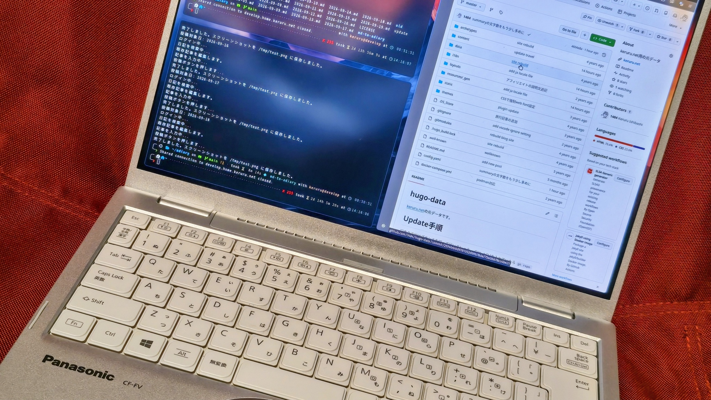

昨今どんどん高性能・高機能化してノートパソコンの価格が高騰しています。昨年度くらいまではそれでも決算セールなどでそこそこのお値段で購入できましたが、2029年くらいまでは値段は下がらないとの見通しなので買い替えで困る時期が貴方にも訪れてしまうかもしれません。この波はノートパソコンだけではなくスマートフォンにも影響しており、最新モデルではとうとう50万円近いスマートフォンが登場したり、新型・最新モデルのハイエンド機種なのに昨年度のハイエンド機種よりもメモリ容量が削減されたりする現象も見られます。

そんな空気を察したため昨年度末に駆け込みでノートパソコンを買いました。購入したノートパソコンは一昨年度のハイエンド機種でクリアランスセールになっていたものです。メモリ容量は多ければ多いほど正義！と考えているのでメモリ容量64GB、ストレージの価格も高騰していたため折角ならと2TBとした結果、価格は28万円となりました。

これでもかなり良い買い物をしたなと感じては居るのですが高級品のため盗難のおそれがある海外旅行にはちょっと怖くて持っていけないと感じています。持ち歩かないのであればデスクトップパソコンで良かったのでは？と考えてしまう結果となってしまっています。

## 中古ノートパソコン市場が賑わっている

もともと昔から賑わっていましたがここへ来て加熱しているように感じます。
2026年現在はIntel Core Ultra第3世代(Panther Lake)ですが、現在中古・ジャンク市場では2020年発売頃の第11世代インテルプロセッサ(Tiger Lake)の物であればおよそ2万円〜3万円で買えます。少し奮発すると2022年頃発売の第13世代(Raptor Lake)の物が5万円くらいで買えます。もしWindowsで用いるのであれば第13世代以降のものでメモリが16GB搭載のモデルを選択されるのが良いかと思います。この位のスペックであればあと5年位戦えそうな気がします。

業務用ではなく個人利用ですしWindowsに拘りがなければ第11世代のものが良さそうです。

時代背景として2020年頃といえば、そうCOVID-19の流行がありました。その結果何が起こったか、ご存知の通り毎日会社へ出社して業務を行っていた人々が在宅勤務に切り替わりました。それまでも企業によってはノートパソコンを貸与していた企業も多いかと思いますが、デスクトップPCのほうが安いですから会社では全員にデスクトップPCを貸与、出張時に出張用のノートPCを借用、みたいな働き方もまだまだ多かったと思います。それら企業が一斉に在宅勤務のためにノートPCを購入、2020年頃も実は少し価格が値上げ（と言うよりはディスカウント率が下がった程度）し、在庫もあまりない状態となりました。

それら企業のリースは4年から5年、つまりここ数年で一気にリース品が中古市場に流れることとなりました。

## コロナ禍世代のノートPCの劣化傾向

実はここ数年で3台程この世代のノートPCを購入しました。そこで感じた劣化具合に傾向があることがなんとなく見えてきました。個人的な私の感想になるので必ずしもすべての中古ノートパソコンに当てはまるものではありません。

### 意外に劣化していないもの

- 外装

    この頃のノートパソコンはそもそも出張に出かけられないため外出に持ち歩かないため外装の劣化がとても少ないと感じます。

- バッテリー

    ずっとACアダプターを繋いでデスクトップ代わりに使うような使い方となるため、バッテリーの劣化も比較的少なめです。昔のノートパソコンはACアダプターを繋げっぱなしでデスクトップのような使い方をすると少し放電してすぐ充電してを繰り返す過充電などでバッテリーが死んでしまうことが多かったですが、最近のノートパソコンはバッテリーマネジメントがされているので、月に1度くらい放電して再充電することを自動で行ったりとバッテリー劣化を防ぐ仕組みがあります。

### 使い方次第なんだろうなと思うもの

- キーボード

    外付けキーボードやマウスを使っている方が多いのだと思いますが、たまにキーボードに使用感（テカリ）がまったくないものがあります。これはちょっと嬉しい。

- トラックパッド

    キーボードのところにも書きましたが、キーボードはノートパソコンのキーボードを用いてもポインター操作だけはマウス、って言う方多いですよね。そのためかトラックパッドにテカリが出ている個体はとても少ないです。

- ディスプレイ

    ディスプレイはキーボードと相関があるように感じました。外付けキーボードを使っている人はノートパソコンを閉じてクラムシェルモードで用いる方が多いのだと思います。その結果としてキーボードにテカリが少ない個体についてはディスプレイの焼付きも少なく感じました。

    ただ逆に、ノートパソコンを閉じたまま小型デスクトップのように利用するクラムシェルモードで使っていたがために液晶が傷んでいる機種もありそうです。それが上の写真のLet's Note CF-FV1のようなモデル。このモデルは**キーボードとディスプレイの間にあるスリットから排熱**します。閉じたままでも排熱するように角度はつけられて入るのですが、電源スイッチがPCの手前（緑色のリッドスイッチ）にあるため、ヒンジ部分が下に来るように立てかけて使われているケースが多いのだと思います。
    当然**熱は上に逃げるのですから、排熱が液晶の下部を常に温める形**となり、この個体もそうなのですが**液晶下部に焼け**が見られます。

    ですので、このような機種を買い求める際は液晶焼けについて自分の許容範囲かどうか実物を見た方が良いかと思います。

## Linuxは流石に...と言う方はChromeOS Flexがオススメ

第11世代のノートパソコンでもWindows11が動かなくはないです。快適ではないですがイライラする程ではないかなと感じています。ですのでWindowsのまま用いても良いのですが、より軽快に使えるLinuxベースのOSがオススメです。

Linuxで問題ない方はLinuxを入れればよいかと思いますが、[ChromeOS Flex](https://chromeos.google/intl/ja_jp/products/chromeos-flex/)に挑戦してみては如何でしょうか。特に旅行先でちょっとした調べものをしたりSNSやBlogを書いたりする用途であればWindowsが入っていてMicrosoft Officeが入ってないと！と言うことも無いかと思います。ブラウザとちょっとしたメモが取れれればOKと言う方であればChromeOS Flexがピッタリです。

## 気軽に運んで雑に使える、これこそノートパソコンでしょ

価格が数万円程度で盗難や旅先での破損があってもがっかりせず、クッション性がしっかりしたしっかりしたケースに仕舞い込むのではなく雑にトートバックに出し入れできる。
持ち運びや利用にあたってあまり気を使わずに使える、これこそノートパソコンだと思っています。

先週旅行に携行しましたがとても良かったので、今後も可能な限りこの方針で端末を調達できるよう業界動向をチェックして行きたいと思います。

